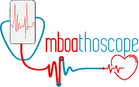

Outreachy - Dec 22’ - March 23’ | Improve Digital Stethoscope app
# **Project Timeline** 
MBOALAB - IMPROVE DIGITAL STETHOSCOPE APP

I have designed the offial website for the **Digital Stethoscope app**

- The website has been designed using **HTML, CSS, Saas, JavaScript, Bootstrap, and jQuery**.
- It has been deployed using vercel and it runs on a CI/CD pipeline with github actions. It has been configured to deploy automatically on every push to the main branch.

Notes: *The website contains random content and images for now. I will update it with the real content and images once the app is ready.*

[You can visit the website using this link](https://mboathoscope.vercel.app)