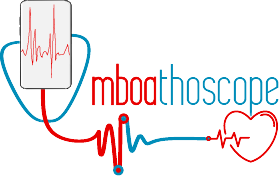

## OUTREACHY DEC 22'- MARCH 23'
### MboaLab (Improve a digital stethoscope app)

#### TASK 2: PROJECT PLAN FOR THE DIGITAL STETHOSCOPE APP

### The focus point 🎈

Digital stethoscopes are use in the **detection and amplification of sounds associated with various organs of the human body**. The Stethoscope is a medical instrument for listening to the action of someones heart or breathing. The Stethoscope is ideal to keep within a medical or first aid room.

### A problem worth to be solved 💧

**Cardiovascular diseases (CVDs)** are the leading cause of death worldwide, according to the **WHO**(World Health Organization).
In 2019, an estimated **17.9 million** individuals died from CVDs, accounting for **32%** of all global deaths. Heart attacks and strokes were responsible for 85% of these deaths. Furthermore, **Over 75% of CVD deaths take place in low- and middle-income countries**. In addition, between 2017 and 2019, an estimated **34,700 persons** died from **lung cancer** in the United Kingdom.

However, **early detection** of these disorders can save lives: **That's where Digital sethoscopes come in**. 
Based on heartbeats, **stethoscopes can be used to detect CVDs early**. Sethoscopes are essential instruments for doctors. They utilize it to monitor their patients' health by diagnosing a variety of issues.
But because the covid-19 pandemic was so widespread, doctors were unable to diagnose all individuals.
Digital stethoscopes are primarily designed for doctors and can also be found now in **first aid kits**. **This demonstrates the value of having a digital stethoscope at home. The difficulty is that the typical price for these stethoscopes is around $250, which is out of reach for most people in developing countries.**

### The ultimate solution 🔥

In 2022, the number of smartphone users in the world today is **6.648 Billion, which translates to 83.32%** of the world's population owning a smartphone. And it is increadibely growing in developping countries.
**That's why this project intends to develop an open source, low-cost and simple-to-use system made up of a digital stethoscope and a mobile app running on android that is inexpensive to all and can be easily distributed to everyone throughout the world, allowing doctors to treat more patients through telemedicine.**

### Solution Overview 🎯

The solution consists of **a mobile software that works on Android and iOS as well as a bespoke low-cost stetoscope that listens to the user's heart or lungs beats and sends the pulse to the mobile app, which monitors everything**. 

This solution can be accomplished by training a **Machine Learning model** to use **sound categorization so that patients can perform self-checkups at any time**, and when the AI finds possible symptoms, the audio data is collected for the patients to send to a doctor for further examination.

 **Every time a patient does a self-checkup, it is kept in this electronic medical record, allowing doctors to have a better understanding of his health state.**

### How does it align with UN SDGs? 📊 
This project aligns with the **SDGs(Sustainale Development Goals)** number 3, and 17. It will help **to reduce the number of people who die from cardiovascular and heart related diseases** , as well as the number of people who die from preventable hearth or lung diseases.

### A valuable impact 🚀

The project intends to create an open source, low-cost, and simple-to-use digital stethoscope that is affordable to all and can be easily distributed to everyone throughout the world, allowing clinicians to treat more patients through telemedicine. **This will result in fewer individuals dying from cardiovascular diseases and other ailments, as well as fewer people dying from preventable heart or lung related diseases.**

### Project's Risks 🙁

- The project might not be able to detect heartbeats and lungbeats.
- The project might not be able to detect heartbeats and lungbeats with a high accuracy.
- The project might not be able to detect heartbeats and lungbeats with a low latency.

### Project's milestones 🎆🎉

 **🥉 Bronze Milestone** Develop the mobile app with all its feaures.

 **🥈 Silver Milestone** Make the digital stethoscope.

 **🥇 Gold Milestone** Train an AI to use sound categorization so that patients can perform self-checkups at any time.

 **💎 Diamond Milestone** Stethoscope listens to the user's heart or lungs beats and sends the pulse to the mobile app, which monitors everything. Every time a patient does a self-checkup, it is kept in this electronic medical record. Official website deployed and branded

### Project deliverables 🚚
- **AI enabled and fully functionning** mobile app for Android and iOS
- Low-cost digital stethoscope
- User manual
- Technical documentation
- Official website for the solution

### Technologies & Tools to be used 🛠
- **Design and Branding**:
    - 📌 **Adobe Figma**: For designing the app's UI.
    - 📌 **Adobe Illustrator**: For designing the app's logo.

- **Frontend**: 
    - ⭐ **Flutter**: Flutter is Google’s UI toolkit for building beautiful, natively compiled applications for mobile, web, and desktop from a single codebase. **It is free and open source**
    - ⭐ **Dart**: Dart is a _client-optimized free and open source programming language_ for apps on multiple platforms. It is developed by Google and is used to build mobile, desktop, server, and web applications.
    - ⭐ **Android Studio**: Android Studio is the official integrated development environment (IDE) for Google's Android operating system, built on JetBrains' IntelliJ IDEA software and designed specifically for Android development.
    - ⭐ **Xcode**: Xcode is an integrated development environment (IDE) for macOS containing a suite of software development tools developed by Apple for developing software for macOS, iOS, watchOS, and tvOS.

- **Backend**:
    - 🔴 **Python & Flask**: Flask is a micro web framework written in Python. It is classified as a microframework because it does not require particular tools or libraries.
    - 🔴 **Heroku**: Heroku is a cloud platform as a service supporting several programming languages that is used as a web application deployment model.

- **Machine Learning**:
    - 🔖 **Tensorflow**: TensorFlow is a free and open source end-to-end open source platform for machine learning.
    - 🔖 **TensorBoard**: TensorBoard is a suite of web applications for inspecting and understanding your TensorFlow runs and graphs.
    - 🔖 **Google cloud**: Google Cloud is a suite of cloud computing services that runs on the same infrastructure that Google uses internally for its end-user products, such as Google Search, Gmail, file storage, and YouTube. We will use it to train our ML model with less effort.
    - 🔖 **Google Collab**: Google Colaboratory, or Colab for short, is a Google research project created to help disseminate machine learning education and research. It's a Jupyter notebook environment that requires no setup to use, while providing free access to computing resources including GPUs.

- **Storage and Baas**:
    - 🔥 **MongoDB or Firestore**: MongoDB is a cross-platform document-oriented database program. Classified as a NoSQL database program, MongoDB uses JSON-like documents with optional schemas.
    - 🔥 **Firebase authentification**: Firebase Authentication provides backend services, easy-to-use SDKs, and ready-made UI libraries to authenticate users to your app.
    - 🔥 **Firebase storage**: Firebase Storage is a cloud storage service for Firebase apps, made for storing and serving user-generated content. It is backed by Google Cloud Storage and offers the same reliability, scalability, and security.

- **Hardware**:
    - Mini-stehoscope
    - Cisor
    - Mini-microphone
    - Speaker

- **Versionning**
    - 💧 **Git**: Git is a free and open source distributed version control system designed to handle everything from small to very large projects with speed and efficiency.
    - 💧 **Github**: GitHub is a web-based hosting service for version control using Git. It is mostly used for computer code. It offers all of the distributed version control and source code management (SCM) functionality of Git as well as adding its own features.

- **Webiste**
    - ⚡ **HTML5**: HTML5 is the latest evolution of the standard that defines HTML. The term represents two different concepts. It is a new version of the language HTML, with new elements, attributes, and behaviors, and a larger set of technologies that allows more diverse and powerful Web sites and applications.
    - ⚡ **CSS3**: Cascading Style Sheets (CSS) is a style sheet language used for describing the presentation of a document written in a markup language like HTML.
    - ⚡ **Javascript**: To make the web pages reactive and interactive.
    - ⚡ **Bootstrap or Tailwind**: For designing and styling the website's UI.
    - ⚡ **Vercel**: Vercel is a cloud platform for static sites and Serverless Functions that you can deploy instantly, and scale automatically.

- **Documentation**
    - 🔵 **QuilBot**: AI paraphrasing tool.
    - 🔵 **Google Docs**: Cloud based SaaS used to write and design documents

### Project plan for the digital stethoscope app
The project can be divided into three main aspects: **Design**, **Development**, and **Testing**.
- **DESIGN**:
    - Design the app
    - API and database design
    - Design the stethoscope
- **DEVELOPMENT & TESTING**
    - **Front-end**
        This is basically the integration of the UI design. Flutter is the ultimate technology to use for this part.
    - **Machine Learning**
        This is the development of the AI model that will be used to classify the sound and detect the pulse rate. We will use Python & Tensorflow for this part.
    - **Back-end development**
        After developing the AI model, we will integrate it with the app. That's why we will deploy the model on Tensorflow Serving and use the API to communicate with the app through both gRPC as well as HTTPS inference endpoints.
    - **Testing**
        We will test the app and the stethoscope to ensure that everything is working as expected. This activity will be continuous throughout the development process.

- **TECHNICAL DOCUMENTATION & BRANDING**
    - redaction of the technical documentation
    - redaction of user manual
    - conception of app's mockups and flyers

### DETAILLED PROJECT TASKS
After a strong understanding of the project, we have come up with a project plan for the digital stethoscope app. **The project plan is divided into 4 phases**, each phase has a specific goal and a list of tasks to be completed.

🗓 **Total duration** 75 days

- #### PHASE I: MOBILE APP DEVELOPMENT

| Task      | Description | Technologies | Time frame  |
| --------- | ----------- | ------------ | ---------  |
| **Design of logo**| Design of the app identity and project's logo | Adobe Illustrator, Figma | 2 days |
| **Design of app**   | UI design of the mobile app | Adobe Figma | 1 week |
| **App setup**   | Creation of mobile app project and configuration of everything | Flutter, VS code, Git & Github | 1 day |
| **UI integration**   | Implementation of the UI design | Flutter, VS code, Git & Github | 1 week |
| **Internationalization**   | Implementing multi-language support for the app | Flutter, Localazy, Git & Github | 2 days |
| **App theming**  | Implementing dark/light mode switch in the app | Flutter | 1 day |
| **Authentication**   | Implementing OTP authentication | Flutter, Firebase | 1 day |
| **AI model training**  | Training the AI model  | Python, Tensorflow, | 2 weeks |
| **Backend deployment**  | Deployment of AI model and API  | Python, Flask, Heroku, gRPC, Tensorflow Serving | 3 days |
| **Backend Integration**  | Integration of the ML model to the mobile app  | Flutter, REST APIs, Git & Github | 3 days |
| **Features Integration**   | Implementing of other features specified by the UI design | Flutter, Firebase,Dart, REST APIs, Python | 1 week |
| **App deployment**   | Deployment for the app for public & free download | Playstore, Apkpure | 2 days |
| **Website**   | Development & Deployment of the official website of the solution | Vercel, Git & Github, HTML5, CSS3, Javascript | 5 days |

- **TOTAL DURATION:** 55 Days

> NB 
    > - The time frame is an estimation of the time needed to complete each task. **It can be changed depending on the progress of the project**.
    > - The progression **will be tested by mentors after each task** to ensure that everything is in the right track.

- #### PHASE II: STETHOSCOPE CONCEPTION 
In this phase, we will make the digital stethoscope by following the steps specified [in this video](https://www.youtube.com/watch?v=Ecgj3-3AWA8&ab_channel=PeterMa).
- [x] Tools needed
    - Mini microphone
    - Mini stethoscope
    - USB adapter
    - Cisor
- [x] Steps to be followed
    - Cut the microphone
    - Cut the stethoscope
    - Connect the microphone to the stethoscope
    - Connect the USB adapter to the microphone
    - Connect the USB adapter to the smartphone
    - Test the stethoscope
- [x] Time frame
    - 1 day

- #### PHASE III: TESTING & FINAL TOUCHES (2 weeks)

During this phase, we will test the app and the stethoscope to ensure that **everything functions properly**.
We'll try to record the sound of the heart and lungs and send it to the app to determine if the AI model is functioning properly.
**If the AI model does not perform as expected, we will attempt to improve it by training it with additional data.
Similarly, if a bug is discovered in the program, it will be corrected and tested again until everything works as it should.**

- #### PHASE IV: TECHNICAL DOCUMENTATION & BRANDING (1 week)

| Task      | Tools | Time frame |
| --------- | ------------ | ---------  |
| 🔵 redaction of the technical documentation| Google Docs, Quilbot | 2 days |
| 🔵 redaction of stethoscope's user manual| Google Docs, Quilbot | 2 days |
|🔵  conception of app's mockups and flyers| Adobe Illustrator, Figma | 2 days |

### Anticipated challenges 🚀
- **Official Website**: The website is deployed at [https://mboathoscope.vercel.app/](https://mboathoscope.vercel.app/) 🎉🎉🎉  However, it is not yet fully functional. We are still working on it.

- **App UI design**: [The UI design of the app is can be found here](https://www.figma.com/file/CZ8Z362zm5Qtgm41TkHtMG/mboathoscope?node-id=0%3A1)🎉🎉🎉. It is not yet complete and we are still working on it.