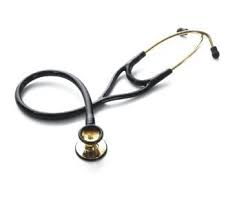
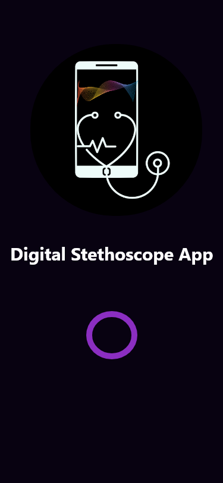

# Improvement To The Digital Stethoscope App

### Methodology for the Design of the Project's Application:
This will give a step-by-step understanding into the application we want to build, which is a cost effective but efficient Digital Stethoscope android application, which uses AI to Diagnose respiratory symptoms by sound classification and pulse rate determination.

## Tools Needed for The Project:

### Software Development Tools:

***
 [**Android Studio**](https://developer.android.com/studio/) 
***

### Hardware Tools:

***
 **Stethoscope**
 **Microphone**
***
### Other Hand Tools:
***
**Scissors**
***

## Introduction:

Given the rate at which infectious diseases like Ebola continue spreading in some countries who have shortage in their healthcare provider supplies and cannot afford the more costly healthcare materials, as the effect of these diseases cannot be over emphasised. These infectious diseases spread when the carier of such disease comes in contact or close proximitty(in the case where the disease is air-borne) with another individual, this spread can be curbed by prevention of contact with or close contact between the carier and other individuals. Telemedicine will come into play, as we plan on creating a digital stethoscope that can record patient's pulse, through an AI's sound classification give a feedback of what the patient is suffering, or whether the individual has no sypthoms of respiratory issues.

The Digital Stethoscope App is focused on creating an android application that will be affordable and can be embraced easily by people of all cultural or financial backgrounds, so that medical practisioners or end-users who make use of this application can be protected from contacting some of the infectiious diseases, which can be transferred because of nearness to the carier of such infectious disease, when their pulse rates want to be recorded for further examination by a doctor.

### Telecare or Telemedicine:

Telecare has become an important part of medical sciences as it expands patient access to care, helps manage recovery and well-being of a patint at home while remotely monitoring risks/early warning signs. This will help in delivering healthcare in countries like Uganda, who announced a three-week lockdown in two districts of the country because of Ebola outbreak in the country.

In such countries who are on lockdown, their economic powers are affected negatively, so they may not afford some healthcare equipment like the Digital Stethoscope. Therefore, an android application and an AI can do much of these jobs needed to be done by the medical equipment, and the data generated can be sent to a doctor who works remotely for further examination.

## Developing a Digital Stetoscope with AI

This project is focused on building an open sourced digital stethoscope that is affordable, which can be given to anyone in all parts of the world, and this can help doctors to aide a better telecare system where they can treat more people remotely.

An AI will also be trained to use sound classification, which will enable patients to do a self checkup at the convinience of their homes, so that when the AI detects any respiratory symptoms, the data which is in audio form is recorded for the patients to sent to a doctor for further examination.

## Step 1: Getting The Hardware Components Ready for Audio Recording

To get the hardware components ready, we need a Stethoscope and a tiny microphone which can fit to the tube of the stethoscope.

As these two materials has been acquired, we have to cut the tube of the stethoscope and attach it to the tiny microphone. by attaching this, the pulse sound will be transmitted from the diaphragm to the microphone.

## Step 2: Recording

As we have built the hardware componenets of the digital stethoscope from the two basic materials, we can use it to record our pulse and also our respiratory system. This recording can be done using a phone recorder.

.png)

## Step 3: AI Sound Classifiction Training Using Tensorflow

After users have recorded their internal sound from the stethoscope, tensorflow sound classification will help to determine whether the symptoms are COVID related, or other diseases related.

## Step 4: Building an Android Application

To run on Android, we have to run the TensorFlow lite which is a mobile library for deploying models on mobile, microcontrollers and other edge devices.

Once we have everything set up we can load it up into our app for sound classification. On the application a recorder will be built in, which help to record voice files, which will later be sent to the doctor afterwards for further examination.

## How The App Looks

Below is a user interface proposed for the Digital Stethoscope App, the prototype preview can be seen in the link [Preview Application](https://www.figma.com/proto/zLD9bc798qMO6aVQ3V0Zix/Digital-Stethoscope-app?node-id=1%3A27&scaling=scale-down&page-id=0%3A1&starting-point-node-id=1%3A72)

This was achieveed using Adobe XD for the designs and the protype preview was achieved using Figma.

Below are some of the proposed interface images.

Loaing screen:

Home Screen:

Record pulse Screen:

Respiratory Issue Screen:

No Issue Screen:

## Conclussion

This project is focused on creating an affordable healthcare equipment, which is the Digital Stethscope, which can be given to anyone from any part of the world to use and check their internal sound, which will be tranmitted to an AI powered open sourced android application with sound classification, this will tell the symptoms of the user according their internal sound, these sounds afterwars can be recorded and transferred to a doctor who will carry out further examination on the sounds, for better result.