## OUTRAECHY DEC 22' - MARCH 23'
### MBOALAB (Improve Digital Stethoscope app)

### ABOUT THE TASK
This task requires the applicant to propose a logo design for the Digital Setethoscope android app. In short, the logo should <b> *communicate the project’s core objectives and importance in an interesting way* </b>
### SUB-TASKS DONE
- [x] I documented myself about digital stethoscope apps in general
- [x] I studied and understood in details the task specifications
- [x] Identified tools and softwares to use 
- [x] Documented myself about colour psycology [👉 Reference](https://www.colorpsychology.org/)
- [x] I have read about healthcare colours [👉 Reference](https://99designs.com/logo-design/psychology-of-color/healthcare#:~:text=The%20healthcare%20industry%20relies%20on,nearly%2085%25%20of%20all%20logos.)

 

### SOFTWARE & TOOLS USED
- Adobe Figma
- Adobe Illustrator
- Artboard Studio
- RemoveBG

 

### PROPOSED LOGOS
|First Logo   | Second Logo |
| ----------- | ----------- |
| 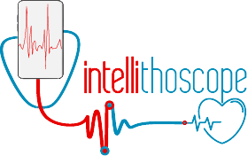      | 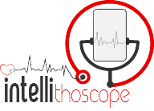        |
| 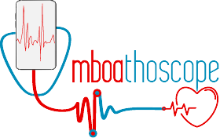   | 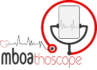        |

> NB: There are many other colour variants for the two proposed logos. Which can be find in the presentation part

 

### PROPOSED LOGOS PRESENTATION
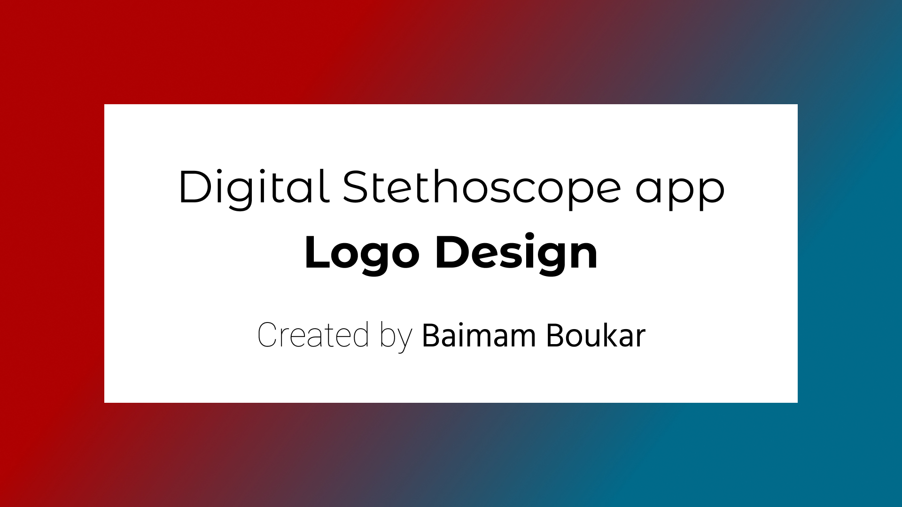
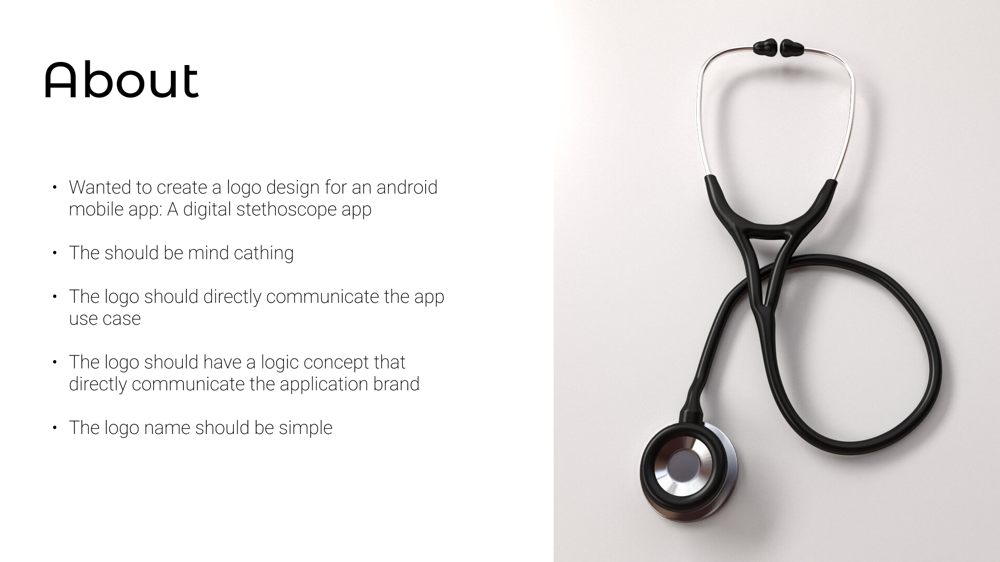

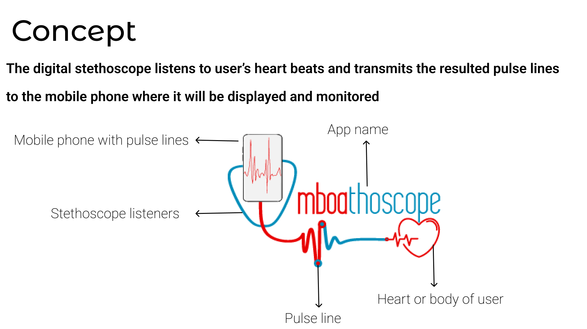
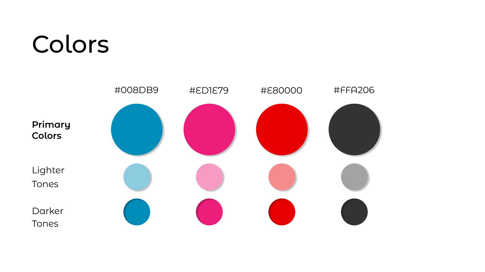
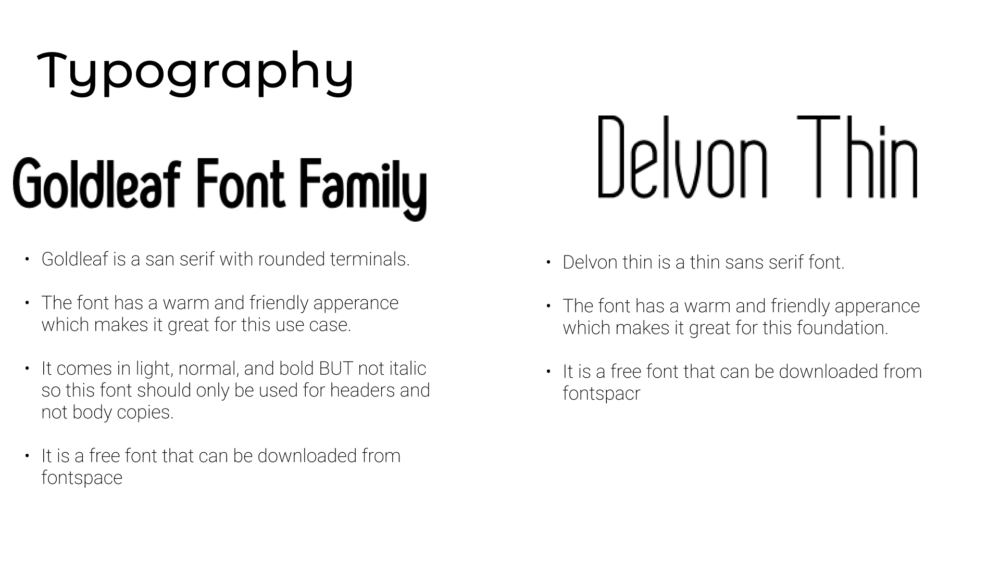
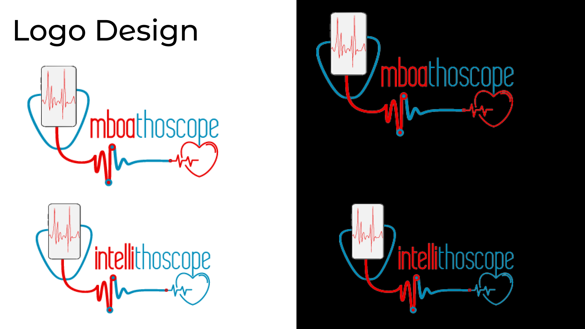
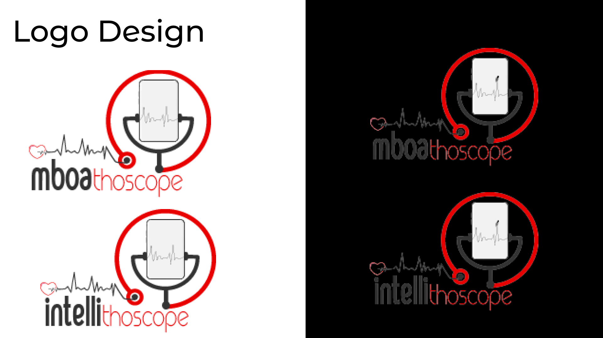
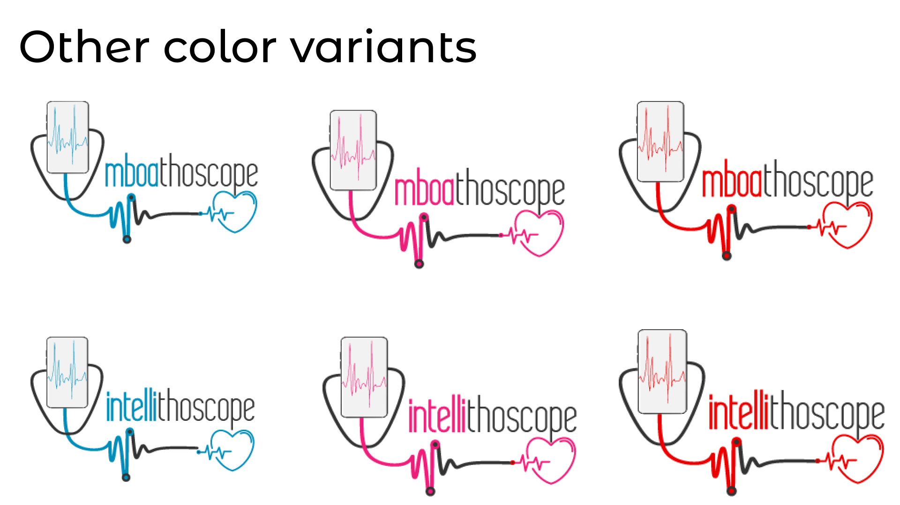
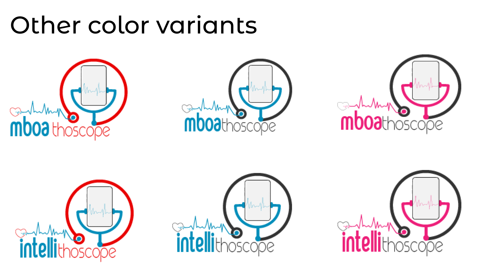
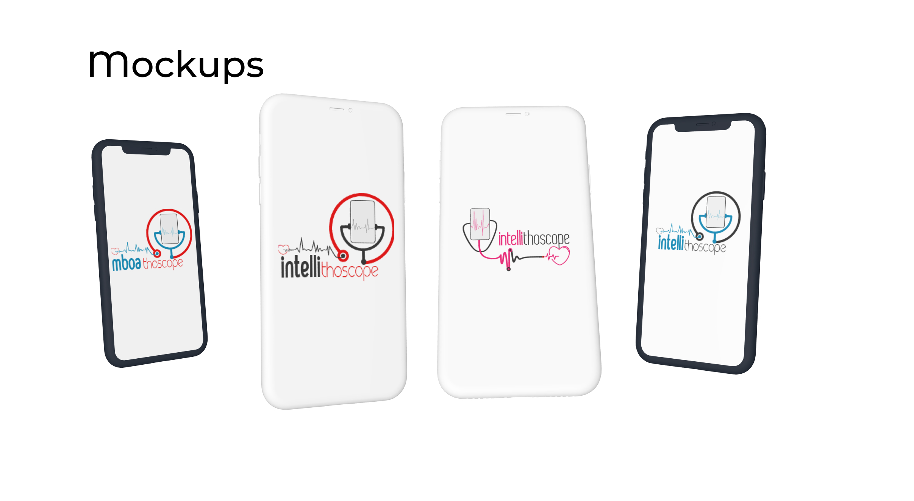
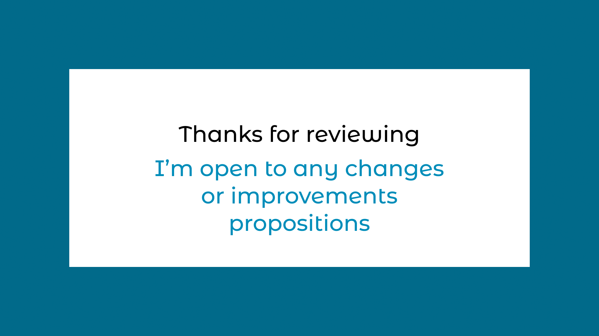

### FEEDACK
Thanks for taking time to review these propositions 😊.
I will be waiting for feedbacks 🤲

### Thanks!
Thanks to the mentors for giving me this wonderful opportunity to contribute to a such amazing project!
I am looking foward to contribute more and bring the **Mboalab's** vision of the **Digital Stethoscope app** to life 🤗! 