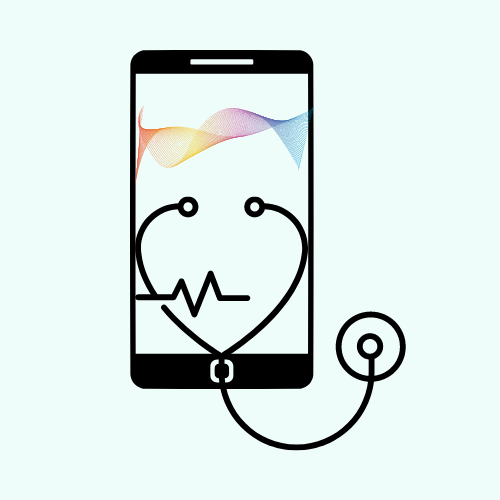
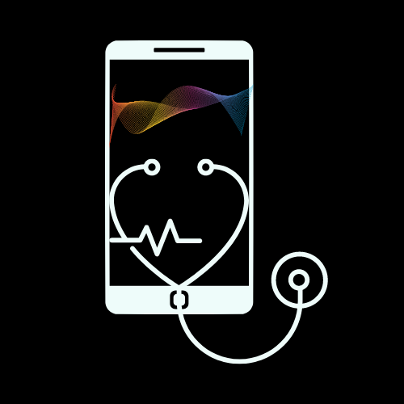

#Designing a Logo for the Project

The aim of the project is, to create a digital stethoscope which can be affordale by people who live in any part of the world.

This stethoscope will be made to work with an Android application which collects the sound generated from the chest-piece of a stethoscope and transferred via the tubing, and this data will be transformed into its digital form via a microphone which is connected to an android phone that serves as a headset part of a stethoscope, where the sounds generated can be used for analysis of the internal organ performance and can also be recorded for further analysis by the doctor.

With these information gathered about the project in mind, I made a logo that I propose be used for the project, this logo was made using canva, and are in two modes of dark and light modes.

*Digital Stethoscope light*

*Digital Stethoscope dark*